# Study Plan: Building ReviewLinter.omnifocusjs from Scratch

ReviewLinter is an OmniFocus Omni Automation plugin that audits a GTD task database for hygiene issues (stale dates, empty projects, waiting-for items). Building it requires mastering JavaScript module patterns, the GTD methodology, the OmniFocus data model, and the OmniJS plugin runtime's strict load-time constraints — none of which are covered by standard web-development experience.

---

## Dependency Tree

```mermaid
graph TD
    subgraph "Phase 1 — JavaScript Foundations"
        JS_IIFE["IIFE module pattern\n(load isolation, no import/export)"]
        JS_ASYNC["async/await + try/catch\n(promises, cancellation idiom)"]
        JS_REGEX["Regex\n(test, match, replace in-place)"]
        JS_SET["Set\n(deduplication, has/add)"]
        JS_DATE["Date API\n(getTime, floor arithmetic, day boundaries)"]
        JS_ARRAY["Array methods\n(filter, some, find, forEach)"]
    end

    subgraph "Phase 2 — GTD Methodology"
        GTD_CORE["GTD Core\n(projects, next actions, inbox, tags)"]
        GTD_DATES["Defer vs Due\n(semantics: start-gate vs deadline)"]
        GTD_WAITING["Waiting For\n(stamp-based tracking pattern)"]
        GTD_REVIEW["Weekly Review\n(staleness, hygiene cycles)"]
    end

    subgraph "Phase 3 — OmniFocus Data Model"
        OF_PROJECTS["Projects & Tasks\n(root task duality, flattenedTasks)"]
        OF_STATUS["Status Enums\n(Task.Status, Project.Status)"]
        OF_TAGS["Tags & Folders\n(flattenedTags, addTag, id.primaryKey)"]
        OF_PROPS["Date Properties\n(deferDate, dueDate, effectiveDueDate, addedDate)"]
        OF_NOTES["Notes\n(plain string field — stamp storage medium)"]
    end

    subgraph "Phase 4 — OmniJS Plugin System"
        OMNI_BUNDLE["Bundle Structure\n(manifest.json, Resources/, identifier)"]
        OMNI_LOADTIME["Load-time vs Runtime\n(two-phase execution model)"]
        OMNI_PREFS["Preferences API\n(.read/.write, load-time constraint)"]
        OMNI_LIB["PlugIn.Library\n(IIFE returns library object)"]
        OMNI_ACTION["PlugIn.Action\n(async handler, this.plugIn.library)"]
        OMNI_UI["UI APIs\n(Alert, Form, Form.Field, validation callback)"]
    end

    subgraph "Phase 5 — Plugin Architecture Patterns"
        ARCH_SINGLETON["Library Singleton\n(shared prefs captured at load time)"]
        ARCH_SCOPE["Scope Resolution\n(null-sentinel, resolveProjects pattern)"]
        ARCH_GUARDS["API Version Guards\n(taskStatus/addedDate undefined probing)"]
    end

    subgraph "Phase 6 — Lint Engine Design"
        LINT_CODES["Reason Code System\n(P_*/T_* codes, stamp aggregation)"]
        LINT_STAMP["Stamp Idempotency\n(upsertStamp regex replace-in-place)"]
        LINT_DEDUP["Task Deduplication\n(Set-based, inbox + project merge)"]
    end

    subgraph "Phase 7 — Fix Pack & Remediation"
        FIX_DUAL["Dual-Loop Pattern\n(child tasks + project root tasks separately)"]
        FIX_POLICY["Policy-Driven Mutation\n(today / clear / next_week policies)"]
    end

    JS_IIFE --> OMNI_LIB
    JS_IIFE --> OMNI_ACTION
    JS_ASYNC --> OMNI_ACTION
    JS_REGEX --> LINT_STAMP
    JS_SET --> LINT_DEDUP
    JS_DATE --> OF_PROPS
    JS_ARRAY --> OF_PROJECTS

    GTD_CORE --> OF_PROJECTS
    GTD_CORE --> OF_TAGS
    GTD_DATES --> OF_PROPS
    GTD_WAITING --> LINT_CODES
    GTD_REVIEW --> LINT_CODES

    OF_PROJECTS --> ARCH_SCOPE
    OF_STATUS --> ARCH_SCOPE
    OF_TAGS --> ARCH_SCOPE
    OF_PROPS --> LINT_CODES
    OF_NOTES --> LINT_STAMP

    OMNI_BUNDLE --> OMNI_LOADTIME
    OMNI_LOADTIME --> OMNI_PREFS
    OMNI_LOADTIME --> OMNI_LIB
    OMNI_LIB --> ARCH_SINGLETON
    OMNI_PREFS --> ARCH_SINGLETON
    OMNI_ACTION --> ARCH_SINGLETON
    OMNI_UI --> LINT_CODES

    ARCH_SINGLETON --> LINT_CODES
    ARCH_SCOPE --> LINT_CODES
    ARCH_GUARDS --> LINT_CODES

    LINT_CODES --> FIX_DUAL
    LINT_STAMP --> FIX_DUAL
    LINT_DEDUP --> FIX_DUAL
    FIX_DUAL --> FIX_POLICY
```



---

## Phase 1 — JavaScript Foundations

**Goal:** Write modern JavaScript that works inside the OmniJS sandboxed runtime — no npm, no bundler, no ES6 `import`/`export`.

| Topic | What to master | Resource starting point |
|---|---|---|
| IIFE module pattern | `(() => { ... })()` as isolation unit; returning an object as the "export" | [MDN: IIFE](https://developer.mozilla.org/en-US/docs/Glossary/IIFE) |
| async/await | `async function`, `await`, `try/catch` for both errors and UI cancellation | [MDN: async function](https://developer.mozilla.org/en-US/docs/Web/JavaScript/Reference/Statements/async_function) |
| Regex | `regex.test(str)`, `str.match(regex)`, `str.replace(regex, fn)` | [MDN: RegExp](https://developer.mozilla.org/en-US/docs/Web/JavaScript/Reference/Global_Objects/RegExp) |
| Set | `new Set()`, `.has()`, `.add()`, iteration for deduplication | [MDN: Set](https://developer.mozilla.org/en-US/docs/Web/JavaScript/Reference/Global_Objects/Set) |
| Date API | `new Date()`, `.getTime()`, millisecond arithmetic, `setHours(0,0,0,0)` for midnight | [MDN: Date](https://developer.mozilla.org/en-US/docs/Web/JavaScript/Reference/Global_Objects/Date) |
| Array methods | `filter`, `some`, `find`, `forEach`, `map`, `includes` | [MDN: Array](https://developer.mozilla.org/en-US/docs/Web/JavaScript/Reference/Global_Objects/Array) |

**Checkpoint:** Write a self-contained IIFE (paste-able in a browser console) that exports an object with: (1) a `daysBetween(dateA, dateB)` function, (2) a `dedupe(arr)` function using `Set`, and (3) an `async wait(ms)` function. No frameworks. Verify in the browser console.

---

## Phase 2 — GTD Methodology

**Goal:** Understand the GTD concepts behind every lint rule — each reason code maps directly to a GTD hygiene failure.

| Topic | What to master | Resource starting point |
|---|---|---|
| GTD Core | Projects (multi-step outcomes), Next Actions, Contexts/Tags, Inbox, Someday/Maybe | *Getting Things Done* ch. 1–5; [GTD website](https://gettingthingsdone.com/) |
| Defer vs Due | Defer = "don't show/work on until this date"; Due = "must be done by this date" — semantically distinct | OmniFocus User Guide |
| Waiting For pattern | Delegated items tracked with a "Waiting" tag; a start-date stamp tracks how long they've been pending | GTD methodology |
| Weekly Review | Why projects must be reviewed regularly; what constitutes a "stale" or "unhealthy" project | [GTD Weekly Review](https://gettingthingsdone.com/2018/08/episode-43-the-gtd-weekly-review/) |

**Checkpoint:** Take any task manager (or a paper list) and apply GTD rules manually: find 2 projects with no next action, 1 task with a defer date in the past, and 1 inbox item older than 2 days. Write down what a lint rule for each would need to check.

---

## Phase 3 — OmniFocus Data Model

**Goal:** Navigate OmniFocus's object graph and understand every property the plugin reads and writes.

| Topic | What to master | Resource starting point |
|---|---|---|
| Projects & Tasks | `flattenedProjects`, `project.task` (root task), `project.flattenedTasks` (includes root) | [Omni Automation — OmniFocus](https://omni-automation.com/omnifocus/) |
| Status enums | `Task.Status.Available`, `.Next`, `.DueSoon`, `.Overdue`, `.Completed`, `.Dropped`; `Project.Status.*` | Omni Automation API reference |
| Tags & Folders | `flattenedTags`, `flattenedFolders`, `tag.id.primaryKey`, `task.addTag()`, `task.tags` | Omni Automation API reference |
| Date properties | `deferDate` (read/write), `dueDate` (read/write), `effectiveDueDate` (inherited, read-only), `addedDate` (OF4+) | Omni Automation API reference |
| Notes | `task.note` and `project.note` are plain strings — the stamp system uses these | Omni Automation API reference |
| Inbox | `inbox` global array, `task.inInbox` boolean | Omni Automation API reference |

**Checkpoint:** Open the OmniFocus Automation console (`Automation → Open Console`) and paste a script that: lists all active project names with task count, prints each project's defer date and due date (or "none"), and prints the count of inbox tasks.

---

## Phase 4 — OmniJS Plugin System

**Goal:** Understand plugin structure, the two-phase execution model, and the APIs available at each phase.

| Topic | What to master | Resource starting point |
|---|---|---|
| Bundle structure | `.omnifocusjs` directory, `manifest.json`, `Resources/` subfolder | [Omni Automation — Plug-In Guide](https://omni-automation.com/omnifocus/plug-in.html) |
| manifest.json | `identifier`, `actions[]`, `libraries[]`, `targets` | This project's `manifest.json` |
| Load-time vs runtime | IIFE body runs at plugin load; action handler runs when user triggers the action | `docs/solutions/runtime-errors/omnijs-preferences-invalid-plugin-property.md` |
| `new Preferences()` constraint | Must be constructed during load time IIFE — throws if called inside an action handler | Same doc above |
| `PlugIn.Library` | `new PlugIn.Library(new Version("1.0"))` returns the export object from a library file | Omni Automation API |
| `PlugIn.Action` | `new PlugIn.Action(async function(selection, sender) { ... })` — the action handler | Omni Automation API |
| `this.plugIn.library("name")` | How action files access the shared library; `this` is bound to the plugin instance | Omni Automation API |
| UI APIs | `new Alert(title, msg)`, `alert.addOption(label)`, `await alert.show()` returns chosen index; `new Form()`, `Form.Field.*`, `form.validate` callback, `await form.show()` throws on cancel | Omni Automation API |
| URL navigation | `URL.fromString(str)` then `url.open()` — NOT `app.openURL()` | Omni Automation API |
| Preferences read/write | `prefs.read("key")` returns `null` if unset; `prefs.write("key", value)` — bracket notation is silently broken | Omni Automation API |

**Checkpoint:** Build a minimal 2-file plugin: `manifest.json` declaring one action, and one action `.js` file that shows an `Alert` with today's date formatted as `YYYY-MM-DD`. Install it via symlink and trigger from the OmniFocus Automation menu.

---

## Phase 5 — Plugin Architecture Patterns

**Goal:** Understand how the shared-library pattern coordinates state and behavior across all five action files.

| Topic | What to master | Resource starting point |
|---|---|---|
| Library as singleton | `lib.prefs` constructed once in the library IIFE; all actions share the same instance via `this.plugIn.library()` | `lintUtils.js:32` |
| `readPref` with fallback | Reads from preferences, falls back to `DEFAULTS`, validates numeric values as finite non-negative integers | `lintUtils.js:34-43` |
| Scope validation guard | Every data-touching action calls `resolveProjects` first; returns early with an alert if it returns `null` | `lintSweep.js:27-37` |
| Form cancellation idiom | `try { result = await form.show(...) } catch (e) { return; }` — a cancelled form throws | `fixPack.js:73-77` |
| Command-Query separation | Functions that compute return values; functions that mutate return nothing — never mixed | `lintUtils.js` throughout |

**Checkpoint:** Extend your Phase 4 plugin with a shared library (`lintUtils`-style). The library holds a `prefs` instance and a `readPref` helper. Wire two different actions to it, both reading the same stored preference.

---

## Phase 6 — Lint Engine Design

**Goal:** Understand how the engine identifies issues, stamps findings idempotently, and handles API version differences.

| Topic | What to master | Resource starting point |
|---|---|---|
| Reason code system | String codes like `P_EMPTY` and `T_OVERDUE` collected into arrays, joined into `@lint(P_EMPTY,T_OVERDUE)` stamps written to the item's note | `lintUtils.js:241-337` |
| Scope resolution (null-sentinel) | `resolveProjects` returns `null` (not `[]`) when a named folder/tag is missing — callers must distinguish misconfiguration from empty results | `lintUtils.js:136-171` |
| Stamp idempotency | `upsertStamp` replaces an existing stamp in-place via regex; only appends if no match — prevents duplicate stamps across repeated sweeps | `lintUtils.js:83-100` |
| API version guards | `task.taskStatus === undefined` probe before using `P_NO_NEXT_ACTION`; `task.addedDate` absence check before `T_INBOX_OLD` | `lintUtils.js:227-235, 315-321` |
| Project root task duality | `project.flattenedTasks` includes `project.task` — must exclude it in every child-task iteration to avoid double-counting | `lintUtils.js:188-191, 245` |
| Set-based task deduplication | `resolveTasksForLint` merges project tasks + inbox tasks using a `Set` to prevent a task appearing twice if it's in both | `lintUtils.js:178-201` |
| Exclude-tag filtering | Projects are excluded by checking `project.task.tags`; tasks by checking `task.tags` directly — root vs child distinction | `lintUtils.js:124-129` |

**Checkpoint:** Write a pure-JS (Node.js-compatible) function that takes an array of mock task objects `{ deferDate, dueDate, inInbox, addedDate, tags, note }` and returns an array of reason-code arrays — one per task. Test with at least four cases: overdue task, stale defer, old inbox item, clean task.

---

## Phase 7 — Fix Pack & Remediation Patterns

**Goal:** Understand how mutations are applied safely, with user confirmation and correct separation of child tasks from project root tasks.

| Topic | What to master | Resource starting point |
|---|---|---|
| Dual-loop pattern | Fix Pack runs one loop over `resolveTasksForLint` (child tasks + inbox), then a second loop over `projects` for root task dates — because root tasks are excluded from the first loop | `fixPack.js:131-209` |
| Opt-in form | Every fix type is an unchecked checkbox by default — the user must explicitly enable each operation before any mutation occurs | `fixPack.js:29-76` |
| Policy-driven mutation | `applyDeferPolicy(task, "today"\|"clear")` and `applyDuePolicy(task, "today"\|"next_week"\|"clear")` — behavior is parameterized, not hardcoded | `lintUtils.js:345-363` |
| Idempotent stamp writes | `@waitingSince` is upserted before checking if it exists; skipped if already present | `fixPack.js:132-144` |
| Count + summary pattern | Mutation counters incremented inside loops; single summary `Alert` shown after both loops complete | `fixPack.js:124-222` |

**Checkpoint:** Build a Fix Pack action on top of your Phase 6 checkpoint: show a form with two checkboxes ("Repair stale defer dates", "Triage old inbox items"), apply selected operations to your mock task list, then show a count summary alert.

---

## Project-Specific Patterns

### 1. Load-Time Preferences Singleton

**What it is:** `new Preferences()` is called once in the library's IIFE body and stored as `lib.prefs`. All five action files share this instance via `this.plugIn.library("lintUtils").prefs`.

**Why not simpler:** Calling `new Preferences()` inside an action handler throws `"Preferences objects may only be constructed when loading a plug-in"`. The OmniJS runtime locks the constructor after the load phase. There is no workaround.

**Minimal sketch:**
```javascript
// lintUtils.js — IIFE runs at load time
(() => {
    const lib = new PlugIn.Library(new Version("1.0"));
    lib.prefs = new Preferences();  // ONLY valid here
    return lib;
})();

// anyAction.js — handler runs at user-trigger time
(() => {
    const action = new PlugIn.Action(async function() {
        const lib = this.plugIn.library("lintUtils");
        const val = lib.prefs.read("myKey");  // safe — already constructed
    });
    return action;
})();
```

**What breaks if you skip it:** Every action trigger throws a runtime error. Preferences never persist.

---

### 2. Null-Sentinel Scope Resolution

**What it is:** `resolveProjects` returns `null` (not `[]`) when a named scope target (folder or tag ID) is configured but no longer exists in the database.

**Why not empty array:** An empty array would be silently treated as "no projects to lint" — a valid but incorrect result. `null` forces callers to detect misconfiguration and surface an alert before doing anything.

**Minimal sketch:**
```javascript
lib.resolveProjects = function(prefs) {
    if (scopeMode === "FOLDER_SCOPE") {
        const folder = flattenedFolders.find(f => f.id.primaryKey === folderId);
        if (!folder) return null;  // misconfigured — caller must alert
        return folder.flattenedProjects.filter(statusOk);
    }
    return flattenedProjects.filter(statusOk);
};

// Caller pattern — in every action:
const projects = lib.resolveProjects(prefs);
if (projects === null) { await lib.showAlert("Scope Not Found", "..."); return; }
```

**What breaks if you skip it:** A stale scope config silently lints zero items, giving a false "all clean" result with no user feedback.

---

### 3. Stamp Idempotency via Regex Replace-In-Place

**What it is:** `upsertStamp` checks for an existing stamp with a regex and replaces it in-place. Only appends if no match found.

**Why not append:** Appending on every sweep would create duplicate `@lintAt(...)` lines indefinitely — one per sweep.

**Minimal sketch:**
```javascript
lib.upsertStamp = function(note, regex, newStamp) {
    if (regex.test(note)) return note.replace(regex, () => newStamp);
    const sep = note.endsWith("\n") ? "" : "\n";
    return note.length === 0 ? newStamp : note + sep + newStamp;
};
```

**What breaks if you skip it:** Notes grow unboundedly; `@lint(...)` and `@lintAt(...)` lines accumulate one per sweep, making notes unreadable and causing ever-growing note strings.

---

### 4. Dual-Loop Fix Pack

**What it is:** Fix Pack runs one loop over child tasks (via `resolveTasksForLint`), then a second loop over `projects` to handle project root task dates.

**Why two loops:** `resolveTasksForLint` explicitly excludes `project.task` from its output (to prevent double-counting during lint). Fix Pack still needs to repair root task defer/due dates, so it processes them in a dedicated second pass.

**What breaks if you skip it:** Project-level defer and due date issues are never repaired by Fix Pack, even though Lint Sweep flags them with `P_DEFER_PAST` and `P_OVERDUE`.

---

## Common Mistakes to Avoid

| Mistake | Correct pattern |
|---|---|
| `this.plugIn.preferences` | Does not exist. Use `new Preferences()` in library IIFE |
| `prefs["key"] = value` | Silently does nothing. Use `prefs.write("key", value)` |
| Guarding `prefs.read()` against `undefined` | `.read()` returns `null` (not `undefined`) for unset keys |
| `app.openURL(url)` | Not a function. Use `URL.fromString(str)` then `.open()` |
| `task.dropped` | Not a property. Use `task.taskStatus === Task.Status.Dropped` |
| Iterating `flattenedTasks` without excluding root | Always `filter(t => t !== project.task)` |
| Appending stamps without checking for existing | Use `upsertStamp` with a regex to replace in-place |
| Returning `[]` from scope resolver when target is missing | Return `null` so callers can distinguish misconfiguration from an empty-but-valid result |
| Flagging `T_WAITING_TOO_LONG` when `@waitingSince` stamp is absent | Only flag when BOTH the waiting tag AND the stamp are present; a missing stamp is not an error |
| Constructing `new Preferences()` in an action handler | Construct at load time in the library IIFE, then share via `lib.prefs` |

---

## Reference Materials

- [Omni Automation — OmniFocus API Reference](https://omni-automation.com/omnifocus/)
- [Omni Automation — Plug-In Guide](https://omni-automation.com/omnifocus/plug-in.html)
- [OmniGroup Automation Forum](https://discourse.omnigroup.com/c/omnifocus/automation/)
- [MDN: IIFE](https://developer.mozilla.org/en-US/docs/Glossary/IIFE)
- [MDN: async function](https://developer.mozilla.org/en-US/docs/Web/JavaScript/Reference/Statements/async_function)
- [MDN: RegExp](https://developer.mozilla.org/en-US/docs/Web/JavaScript/Reference/Global_Objects/RegExp)
- [MDN: Set](https://developer.mozilla.org/en-US/docs/Web/JavaScript/Reference/Global_Objects/Set)
- [MDN: Date](https://developer.mozilla.org/en-US/docs/Web/JavaScript/Reference/Global_Objects/Date)
- [Getting Things Done — GTD Weekly Review](https://gettingthingsdone.com/2018/08/episode-43-the-gtd-weekly-review/)
- `docs/solutions/runtime-errors/omnijs-preferences-invalid-plugin-property.md` — in-repo gotcha reference with full investigation notes
